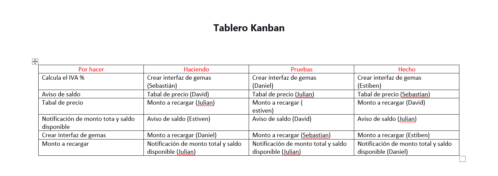

# calculadora-conversion-diamantes
#integrantes 
Daniel Eduardo Criollo Valverde 
David Sebastian Gualavisi Morocho 
David Patricio Collaguazo Pulupa
Victor Julian Amagua Mendoza
Steveen Jahill Guano Andrade
Proyecto realizado para calcular la conversión de dólares a diamantes incluyendo IVA y notificación de saldo disponible.

## Evidencias

### Tablero Kanban

### Flujograma

